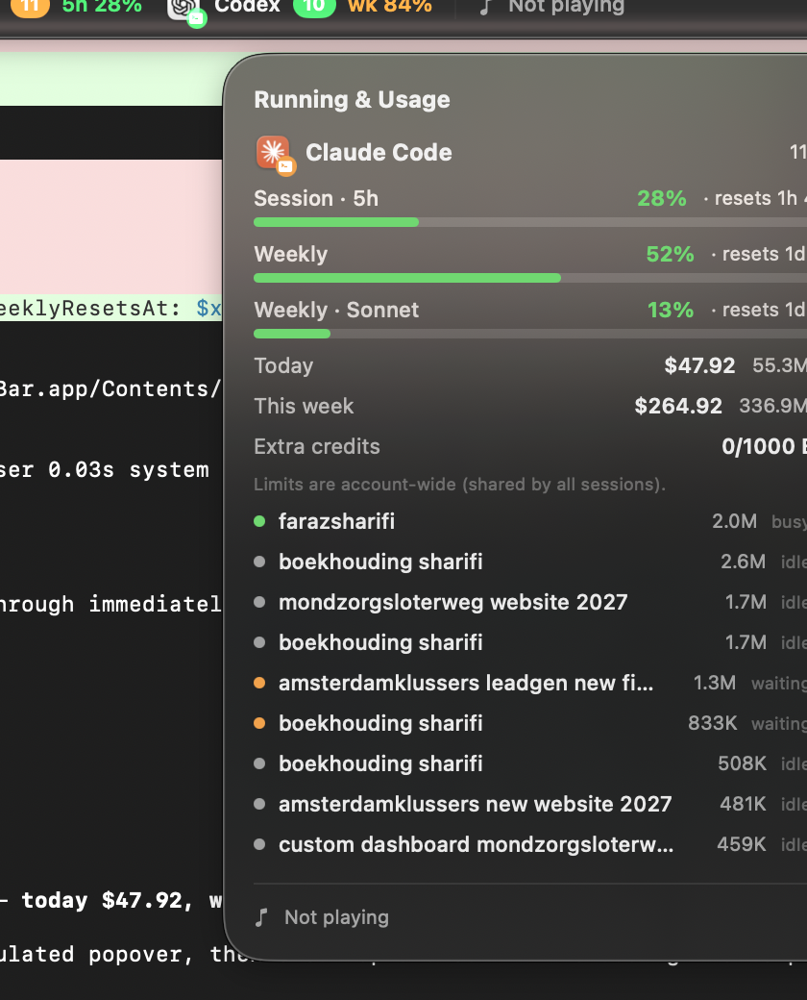

# GlassBar

A tiny **Liquid Glass status HUD** that floats at the top‑center of your Mac and shows, in one glance, **what's running** across your AI / dev tools, **how much of your plan you've used**, and **what's playing** — without touching your Dock or menu bar. When a session finishes, a little **mascot crawls across your screen** and you get a notification.


## The bar

Left → right:

- **App logos** — VS Code · Cursor · Claude desktop · ChatGPT. Full‑color when running, dimmed when not. **Click one to focus it** (or launch it if it's closed).
- **Claude Code** — Claude logo + live **session count** + your real **5‑hour limit used** (e.g. `5h 28%`), colored green/orange/red. **Click to jump to the latest session.**
- **Codex** — OpenAI logo + session count + **weekly limit used** (e.g. `wk 84%`). **Click to open the latest session.**
- **♪** — system‑wide **now‑playing** track, the app making sound, or *Not playing*.
- **⌄** — opens the **Running & Usage** popover.

## The popover



Click the chevron for the full breakdown:

- **Real plan limits** — Session (5‑hour), Weekly, and Sonnet/Opus utilization with reset countdowns.
- **Spend** — today and this‑week cost + tokens, plus extra‑credit balance.
- **Live sessions** — every running session with its **project folder**, **per‑session token usage**, and **busy / waiting / idle** status. **Click a session to jump to the terminal/editor running it.**

Close it with the **×**, the chevron, or by **clicking anywhere outside**.

## Session‑done mascots + notifications

When a Claude Code session goes from *busy* back to idle (work finished), a 🦀 **crab crawls across the bottom of your screen** with the project name, and you get a macOS notification — **tap it to jump straight to that session**. Codex finishing gets a 🦊 (configurable at the top of `main.swift`).

## How it works (data sources)

Everything is read from **local data + your own account** — no third‑party services.

| Signal | Source |
|---|---|
| App running state / logos | `NSWorkspace` |
| **Claude plan limits** | the **same** `GET https://api.anthropic.com/api/oauth/usage` call `/usage` uses, authorized with your OAuth token from the **Keychain** (`Claude Code-credentials`), cached 5 min |
| Claude sessions + status | `~/.claude/sessions/*.json` (name, cwd, busy/idle), filtered to live pids |
| Claude per‑session tokens | summed from each session's `~/.claude/projects/**` transcript |
| Claude spend | [`ccusage`](https://github.com/ryoppippi/ccusage) (today / this week) |
| Codex limits + tokens | newest `~/.codex/sessions/**` rollout (`rate_limits`, `total_token_usage`) |
| Now playing | [`media-control`](https://github.com/ungive/media-control) → app name → CoreAudio "audio playing" |

The bar (running state, now‑playing, sessions) refreshes every 3 s; usage/limits every 60 s. The slow parts (`ccusage`, per‑session tokens) are computed in the background into caches so the helper script always returns in < 0.1 s.

> **Claude limits** are **account‑wide** — shared by *all* your Claude sessions (that's how the plan works), so the popover shows the account limit plus the per‑session list. The first time GlassBar reads your Keychain token, macOS asks permission — click **Always Allow**. The `/usage` endpoint is rate‑limited, so GlassBar caches it for 5 minutes and reuses the last good value if a refresh is throttled.

> **Now playing** only shows a track if it registers with macOS "Now Playing" (Control Center) — Spotify, Apple Music, YouTube, etc. do. A raw HTML5 player (some Shopify pages) may not expose metadata; GlassBar then shows the app's name or *"Audio playing"* when it detects sound.

## Requirements

- macOS **26 (Tahoe)** or later — uses the real SwiftUI Liquid Glass API.
- Swift toolchain (Xcode **or** Command Line Tools: `xcode-select --install`).
- [`media-control`](https://github.com/ungive/media-control): `brew install media-control`
- [`ccusage`](https://github.com/ryoppippi/ccusage): `npm install -g ccusage`
- `jq`, `curl`, `security` — preinstalled on macOS.

## Build & install

```bash
git clone https://github.com/Farazs27/glassbar.git
cd glassbar
./build.sh
```

`build.sh` compiles a release binary, assembles `GlassBar.app`, installs it to `~/Applications`, registers a **login LaunchAgent** (auto‑start), clears any old instance, and launches it. Re‑run any time to update.

## Uninstall

```bash
launchctl bootout "gui/$(id -u)/com.faraz.glassbar"
rm -f ~/Library/LaunchAgents/com.faraz.glassbar.plist
rm -rf ~/Applications/GlassBar.app ~/.cache/glassbar
```

## Customize

- Watched GUI apps: `GUI_APPS` near the top of `Sources/GlassBar/main.swift` (find a bundle id with `osascript -e 'id of app "Name"'`).
- Mascots: `CLAUDE_MASCOT` / `CODEX_MASCOT` constants.

Rebuild with `./build.sh`.

## Notes & limitations

- Session counts reflect **live processes/sessions**, which for agentic setups can exceed your visible terminal windows.
- Clicking a session focuses the **owning app** (terminal/editor); macOS can't reliably switch to the exact tab.
- `media-control` relies on a private MediaRemote bridge Apple has tightened before, so a future macOS update could affect now‑playing.

## License

MIT © 2026 Faraz Sharifi
