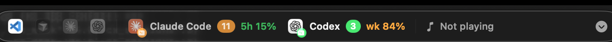

# GlassBar

A tiny **Liquid Glass status HUD** that floats at the top‑center of your Mac and shows, in one glance, **what's running** across your AI / dev tools, **how much of your plan you've used**, and **what's playing** — without touching your Dock or menu bar.



Left → right:

- **App logos** — VS Code · Cursor · Claude desktop · ChatGPT. Full‑color when running, dimmed when not. **Click one to focus it** (or launch it if it's closed).
- **Claude Code** — the Claude logo + live **session count** + your real **5‑hour limit** used (e.g. `5h 15%`), colored green/orange/red.
- **Codex** — the OpenAI logo + live session count + **weekly limit** used (e.g. `wk 84%`).
- **♪** — the current **now‑playing** track (system‑wide), the app making sound, or *Not playing*.
- **⌄** — opens the **Running & Usage** popover.

### The popover

Click the chevron (or a tool) to expand full detail for each tool:

- **Real plan limits** — Session (5‑hour) and Weekly utilization with reset countdowns. Claude also breaks out Sonnet/Opus when present.
- **Live sessions** — every running session with its **project folder** and **busy / waiting / idle** status. **Click a session to jump to the terminal/editor running it.**

Close it with the **×**, the chevron, or by **clicking anywhere outside**.

## How it works (data sources)

Everything is read from **local data + your own account**, no third‑party services.

| Signal | Source |
|---|---|
| App running state | `NSWorkspace` (bundle id) — instant, no permissions |
| App logos | `NSWorkspace.icon(forFile:)` |
| **Claude plan limits** | the **same** `GET https://api.anthropic.com/api/oauth/usage` call that Claude Code's `/usage` uses, authorized with your OAuth token from the **Keychain** (`Claude Code-credentials`) |
| Claude live sessions | `~/.claude/sessions/*.json` (name, cwd, status), filtered to live pids |
| Codex limits | newest `~/.codex/sessions/**` rollout → `rate_limits` (5‑hour `primary` + weekly `secondary`) |
| Codex live sessions | running `codex` processes + working dir |
| Now playing | [`media-control`](https://github.com/ungive/media-control) (system‑wide), then Spotify/Apple Music via AppleScript, then a CoreAudio "audio is playing" check |

Limits refresh every 30 s; running‑state and now‑playing every 3 s.

> **Note on Claude limits:** the 5‑hour and weekly limits are **account‑wide** (shared by *all* your Claude sessions) — that's how the plan works, so the popover shows the account limit plus the per‑session list. The first time GlassBar reads your Keychain token, macOS will ask permission — click **Always Allow**. If the token has gone stale, run any Claude command to refresh it.

> **Note on now playing:** a track only appears if it registers with macOS "Now Playing" (Control Center) — Spotify, Apple Music, YouTube, etc. do. A raw HTML5 audio player (e.g. some Shopify pages) may not expose metadata; in that case GlassBar falls back to showing *"Audio playing"* when sound is detected.

## Requirements

- macOS **26 (Tahoe)** or later — uses the real SwiftUI Liquid Glass API.
- Swift toolchain (Xcode **or** Command Line Tools: `xcode-select --install`).
- [`media-control`](https://github.com/ungive/media-control): `brew install media-control`
- `jq`, `curl`, `security` — preinstalled on macOS.

## Build & install

```bash
git clone https://github.com/Farazs27/glassbar.git
cd glassbar
./build.sh
```

`build.sh` compiles a release binary, assembles `GlassBar.app`, installs it to `~/Applications`, registers a **login LaunchAgent** (auto‑start), and launches it. Re‑run any time to update.

## Usage

- **Drag** the bar anywhere you like.
- **Click an app logo** to focus/launch it.
- **Click the chevron** (or Claude Code / Codex) for the usage + sessions popover; **click a session** to jump to it.
- **Quit** from the popover's *Quit* button.

## Uninstall

```bash
launchctl bootout "gui/$(id -u)/com.faraz.glassbar"
rm -f ~/Library/LaunchAgents/com.faraz.glassbar.plist
rm -rf ~/Applications/GlassBar.app
```

## Customize

The watched GUI apps live in `GUI_APPS` near the top of `Sources/GlassBar/main.swift` — add/remove `AppDef(id:name:tint:)` entries (find a bundle id with `osascript -e 'id of app "Name"'`). Rebuild with `./build.sh`.

## Project layout

```
Sources/GlassBar/main.swift   # model + Liquid Glass UI + floating panels + actions
Resources/glassbar-usage.sh   # emits Claude + Codex limits & live sessions as JSON
packaging/Info.plist          # LSUIElement app metadata
build.sh                      # build → bundle → install → autostart
```

## Notes & limitations

- Session counts reflect **live processes/sessions**, which for heavy/agentic setups can be higher than the number of terminal windows you have open.
- Clicking a session focuses the **owning app** (terminal/editor); macOS can't reliably switch to the exact tab.
- Codex limits come from your **most recent** Codex session and update the next time you run Codex.
- `media-control` relies on a private MediaRemote bridge that Apple has tightened before, so a future macOS update could affect now‑playing.

## License

MIT © 2026 Faraz Sharifi
